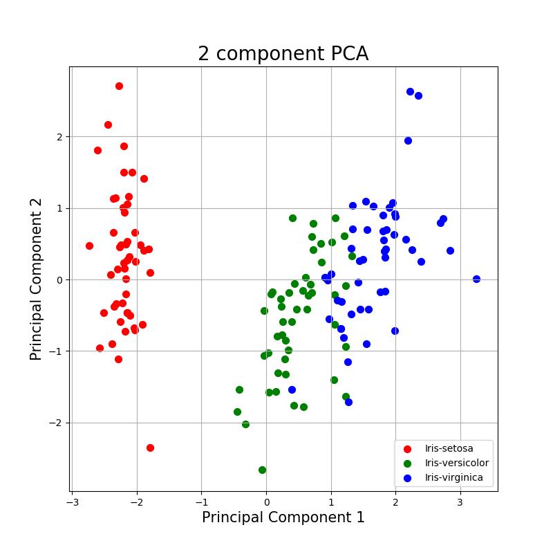
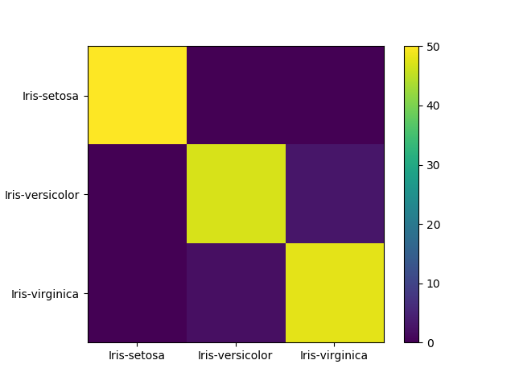

# Iris-Flower-Prediction
Machine Learning Python Script implementing K-means clustering.

Dataset Columns :- 
1. sepal length
2. sepal width
3. petal length
4. petal width
5. class - Iris-setosa, Iris-versicolor or Iris-virginica




```
Confusion Report
                 precision    recall  f1-score   support

    Iris-setosa       1.00      1.00      1.00        50
Iris-versicolor       0.96      0.94      0.95        50
 Iris-virginica       0.94      0.96      0.95        50

       accuracy                           0.97       150
      macro avg       0.97      0.97      0.97       150
   weighted avg       0.97      0.97      0.97       150


Confusion Matrix
[[50  0  0]
 [ 0 47  3]
 [ 0  2 48]]
```
